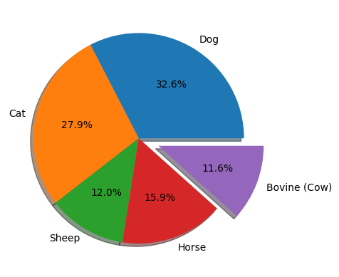

# Animal Pose Estimation
 
## 1. Análise Exploratória

O primeiro ponto que exploro no dataset é como os dados estão distribuidos. Como são 5 categorias, eu suponho que a porcentagem de distribuição seria em torno de 20%.

Após rodar uma análise, percebo uma certa discrepância no balanceamento de dados, principalmente pelo fato de que Cachorros são mais relevantes do que qualquer outro dado. Os bovinos (que neste caso, só encaixam as vacas), equivalem a ~11.6% do dataset.



## 2. Processamento de Imagem

```
for data in json_file['annotations']:
  if data['image_id'] == last:
    continue
  if data['category_id'] == 5:
    bovine_data.append(data)
  qtd_animals[data['category_id'] - 1] += 1
  last = data['image_id']
```

Conforme o pseudo-código, itero sobre cada anotação no arquivo json.

Caso o `image_id` seja igual a do anterior, vá pra próxima imagem. Iisto evita que a mesma imagem seja duplicada, pois algumas imagens possuem uma ou mais annotations, por causa de bbox.

Depois, se o `category_id` == 5, sabemos que aquela annotation está falando de um bovino. Então, coloque esses dados no agregado de informações `bovine_data`

Por último, atualizamos a variável `last`, para evitar repetições como dito acima.

## 3. Resultados

Por fim, eu crio uma função `load_images()` que recebe o pacote de imagens de bovinos, carrega-os da pasta da minha pasta do dataset que está no Drive e mostra uma imagem aleatória, concluindo o pré-processamento e filtragem de dados


## 4. Conclusão

Podemos concluir que o dataset possui um desbalanço na quantidade de dados providos, onde os bovinos se encontram como a minoria. O treinamento de uma modelo utilizando este dataset pode levar a vieses e escassez de informações sobre os bovinos.